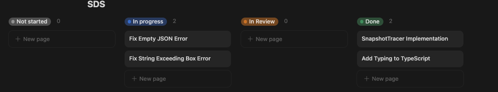
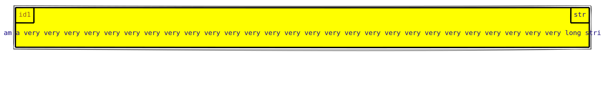
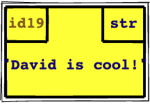
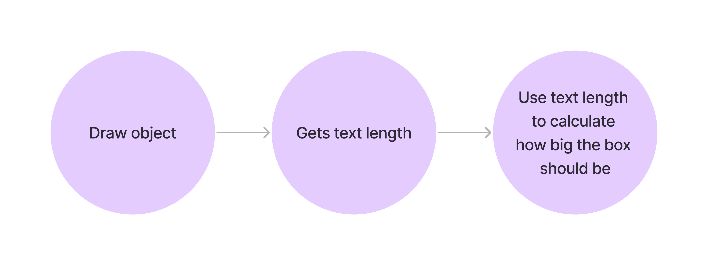
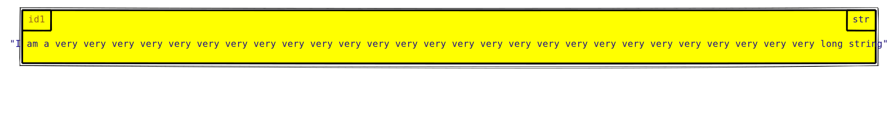
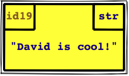

<div class="absolute top-60">

# MemoryViz Oct 18th
</div>

<div class="absolute top-80">

### MemoryViz Bug Fixes

</div>

<div class="absolute bottom-10">

Leo

</div>

<div class="absolute bottom-10 right-10">

Image: Mount Fuji
</div>
---

## Progress



---

# String Exceeding Box

### Issue 1: With the highlight style, the text will exceed the box


### Issue 2: With the highlight style, the quotations are hidden


---

# Writing Tests
1. The text will not exceed the box with any styles
2. The quotations will not exceed the box with any styles

---

# Investigations


---

# Investigations
```js
 /**
  * Return the length of this text.
  * @param s - The given text.
  */
 getTextLength(s: string): number {
     return s.length * 12;
 }
```

<v-clicks>

## Recall the issues:
1. With certain styles, the text will exceed the box
2. With certain styles, the quotations are hidden

Do you notice anything missing in this function? 
- Multiplier is hard coded to 12, regardless of font size
- The quotations are not a part of `s`, so their length was ignored


</v-clicks>

---

# Investigations

## Change 1: Take into account the style
```js {monaco-diff}
getTextLength(s: string): number {
   return s.length * 12;
}
~~~
getTextLength(s: string, textStyle?: CSS.PropertiesHyphen): number {
    if (textStyle?.["font-size"]) {
        return s.length * parseInt(textStyle["font-size"]) * 0.6;
    }
    return s.length * 12;
}
```

---

# Investigations

## Change 2: Account for the quotations
```js {monaco-diff}
const value = "David is Cool!";

getTextLength(`${String(value)}`)
~~~
const value = "David is Cool!";

getTextLength(`"${String(value)}"`)
```

---

# Results

## Before:


## After:


---

# Results

## Before:


## After:


---

# The Challenge? - Demo
[Github PR](https://github.com/david-yz-liu/memory-viz/pull/95/files#diff-853d0002a00c36d641b2b1700cebb268bb15927daed62f875637610b793ade32)

---

# Empty JSON Error

## The Issue

```json
# input.json
[]
```
```bash
> memory-viz input.json
Error: Error: Reduce of empty array with no initial value
```

---

# What should happen?
- An empty diagram should be outputted, using the defined width and height


---

# Writing Tests
- Test both `[]` and `{}` outputs empty diagrams

---

# Investigations
- Leveraging project search and the debugger to quickly identify the source of error

---

# Plan
```ts
const right_most_obj = objs.reduce((prev, curr) => compareByRightness(prev, curr) <= 0 ? prev : curr);
const down_most_obj = objs.reduce((prev, curr) => compareByBottomness(prev, curr) <= 0 ? prev : curr);

const canvas_width = right_most_obj.x + right_most_obj.width + config_aut.right_margin;
const canvas_height = down_most_obj.y + down_most_obj.height + config_aut.bottom_margin;
```

- The existing code increases the canvas width to fit the objects.
- The `reduce` call is used to find the right/down most object, so we can expand the canvas as needed

---

# Plan

Proposed solution: If the array is empty, we can just provide a default object.

```ts {monaco-diff}
const right_most_obj = objs.reduce((prev, curr) => compareByRightness(prev, curr) <= 0 ? prev : curr);
const down_most_obj = objs.reduce((prev, curr) => compareByBottomness(prev, curr) <= 0 ? prev : curr);
~~~
const defaultObject: DrawnEntity = {
    x: 0,
    y: 0,
    width: 0,
    height: 0,
};
const right_most_obj = objs.reduce(
    (prev, curr) => (compareByRightness(prev, curr) <= 0 ? prev : curr),
    defaultObject
);
const down_most_obj = objs.reduce(
    (prev, curr) => (compareByBottomness(prev, curr) <= 0 ? prev : curr),
    defaultObject
);
```

- There are many ways to address this problem
    - For example, we can also use a `null` value with additional checks

---

# Summary


- Investigated and proposed solution for empty JSON error
- Investigated and proposed solution for string exceeding box

## TODO:
- Verify new changes didn't break other features
- Request a review from David