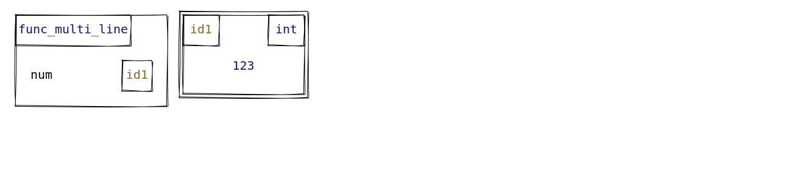
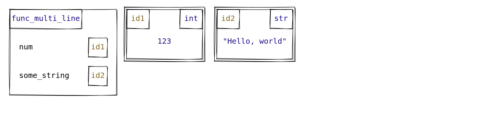
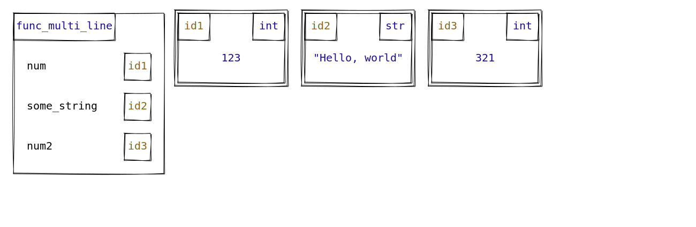
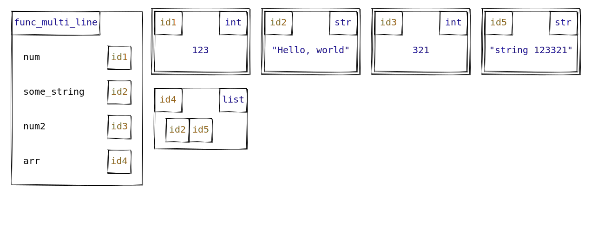
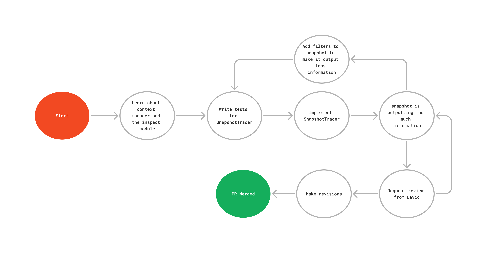

<div class="absolute top-60">

# PythonTA Oct 4th
</div>

<div class="absolute top-80">

## Leo, Sep 27th, 2024
</div>

<div class="absolute bottom-10 right-10">

Image: Kelowna
</div>

---

# A Recap
- Request a review from David
- Examine the test results from Memory-viz and identify areas of improvements for Memory-viz

<br/>

# This Week
- Requested reviews from David for the PRs
- Merged a [PR](https://github.com/pyta-uoft/pyta/pull/1090) to filter variables captured in `snapshot`
- Merged a [PR](https://github.com/pyta-uoft/pyta/pull/1090) for Snapshot Tracer

---

# Snapshot Tracer Demo

```python {5}
def func_multi_line() -> None:
    """
    Function for testing SnapshotTracer
    """
    with SnapshotTracer():
        num = 123
        some_string = "Hello, world"
        num2 = 321
        arr = [some_string, "string 123321"]
```

---

# Snapshot Tracer Demo

```python {5-6}
def func_multi_line() -> None:
    """
    Function for testing SnapshotTracer
    """
    with SnapshotTracer():
        num = 123
        some_string = "Hello, world"
        num2 = 321
        arr = [some_string, "string 123321"]
```

<Transform scale="1.5">


</Transform>


---

# Snapshot Tracer Demo

```python {5-7}
def func_multi_line() -> None:
    """
    Function for testing SnapshotTracer
    """
    with SnapshotTracer():
        num = 123
        some_string = "Hello, world"
        num2 = 321
        arr = [some_string, "string 123321"]
```

<Transform scale="1.3">


</Transform>


---

# Snapshot Tracer Demo


```python {5-8}
def func_multi_line() -> None:
    """
    Function for testing SnapshotTracer
    """
    with SnapshotTracer():
        num = 123
        some_string = "Hello, world"
        num2 = 321
        arr = [some_string, "string 123321"]
```


<Transform scale="1.15">


</Transform>

---

# Snapshot Tracer Demo


```python {5-9}
def func_multi_line() -> None:
    """
    Function for testing SnapshotTracer
    """
    with SnapshotTracer():
        num = 123
        some_string = "Hello, world"
        num2 = 321
        arr = [some_string, "string 123321"]
```


<Transform scale="0.95">


</Transform>

---

# The `SnapshotTracer` Implementation Journey

<Transform scale="1.05">



</Transform>

---

# Learnings - API Design

- As you know, `SnapshotTracer` relies on `snapshot` to take snapshots.

```python
snapshot(memory_viz_args: Optional[list[str]], memory_viz_version: Optional[str], ... other parameters)
```


<div class="grid grid-cols-2 gap-4">

<div>
Instead of 
```python
class SnapshotManager:
    ... instance attributes
    # snapshot parameters
    memory_viz_args: Optional[list[str]]
    memory_viz_version: Optional[str]
    ...

    def __init__(
        self,
        memory_viz_args: Optional[list[str]]
        ...
    )
```
</div>

<div>
Do
```python
class SnapshotManager:
    ... instance attributes
    # snapshot parameters
    _snapshot_kwargs: dict

    def __init__(
        self,
        ...,
        **kwargs
    )
```
</div>
</div>

- Instead of listing each parameter for `snapshot` as an instance attribute, it's better to store all of them in a dictionary and pass it to `snapshot`

---

# Challenges
- Writing tests for `SnapshotTracer`
  - We didn't want some variables to be captured, because they can change depending on the enviornment. 
    - For example, the output directory of the results.
  - Required adding two filters to `snapshot`


---

# Next Week

- Analyze the MemoryViz source code to identify improvements.
- One bug identified is MemoryViz will error when the input is an empty JSON

--- 


# Any Questions?
## `SnapshotTracer`
- How does the `SnapshotTracer` decide which variables to capture or exclude in each snapshot?

## API Design
- Why did we opt for keyword arguments (`**kwargs`) instead of listing all the parameters explicitly in the `SnapshotManager` constructor?

## Testing
- What kind of variables were excluded from snapshots during testing, and why were they problematic?
